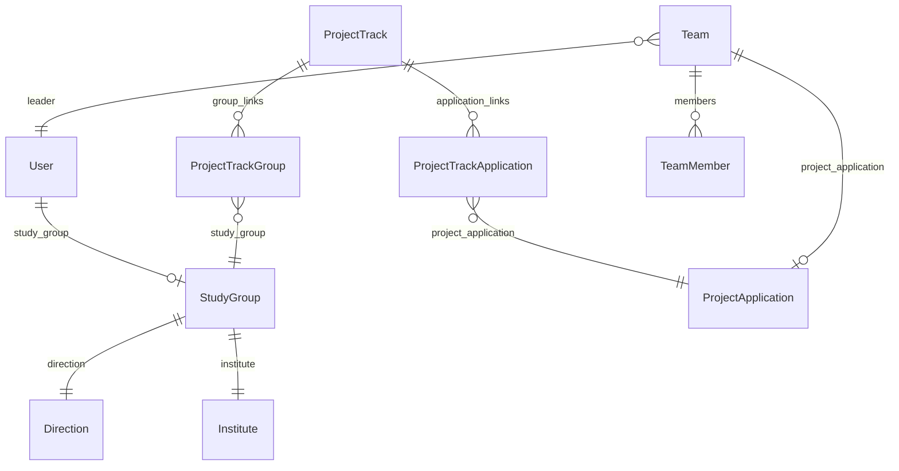
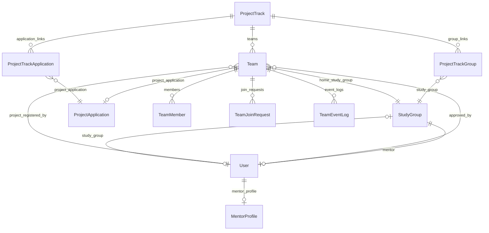
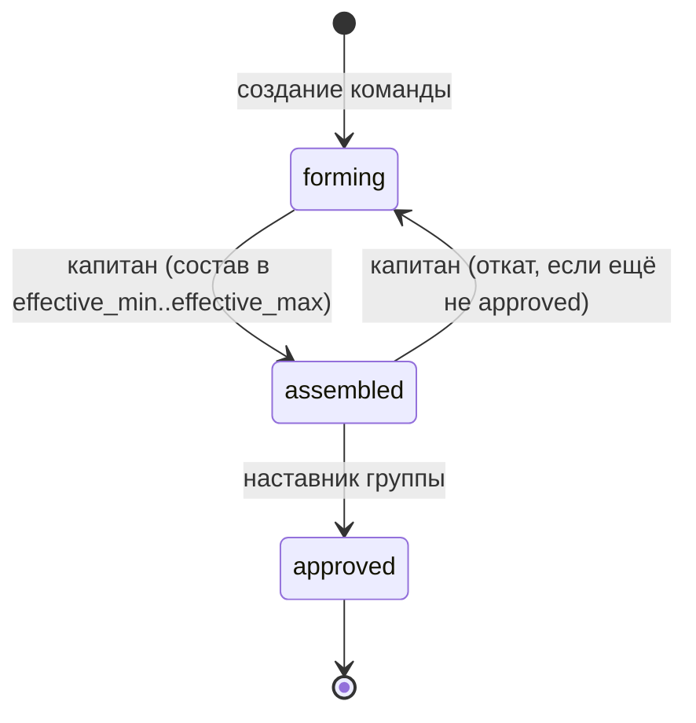

# Схема БД: студенческий портал

Документ описывает **изменения и новые сущности базы данных** для студенческого функционала (5 разделов UI).  
API-эндпоинты, сервисы и DTO в этот документ не входят — только данные и бизнес-правила, влияющие на схему.

**Дата:** 2026-08-21  
**Статус:** проект (до реализации миграций)

---

## 1. Введение и scope

### Разделы UI (взгляд студента)

| # | Раздел | Что нужно от БД |
|---|--------|-----------------|
| 1 | Главная | Группа + наставник (ФИО, должность, степень) |
| 2 | Моя группа | Наставник + список студентов группы с привязкой к команде |
| 3 | Формирование команд | Команды трека, лимит команд, заявки на вступление |
| 4 | Моя команда | Состав, статусы, лог событий, approve/reject/kick/add |
| 5 | Витрина проектов | Проекты трека, таймер регистрации, запись капитана |

### Решения, зафиксированные на этапе проектирования

- **Наставник:** один на учебную группу — `StudyGroup.mentor` (FK → `User`).
- **Лимиты размера команды:** берутся из проектов трека (`ProjectApplication.min_team_members` / `max_team_members`); на этапе формирования — вычисляемые `effective_min` / `effective_max` (см. §5).

### Out of scope (эта итерация)

- Задачи студента, прогресс выполнения проекта, сводка по команде на главной (заглушки UI без новых таблиц).
- Система уведомлений (push/email) — см. открытые вопросы (§9).
- Отдельная модель `Project` — проекты по-прежнему = одобренные `ProjectApplication`.

---

## 2. As-is: текущее состояние

### 2.1. ER-диаграмма (сейчас)



### 2.2. Существующие сущности (релевантные)

| Модель | Файл | Назначение |
|--------|------|------------|
| `User` | `accounts/models.py` | Студент: `study_group`; роль `student` / `mentor` |
| `PreRegisteredStudent` | `accounts/models.py` | Контингент, FK `group` → `StudyGroup` |
| `Direction` | `teams/models.py` | Направление подготовки |
| `StudyGroup` | `teams/models.py` | Учебная группа (name, code, direction, institute, …) |
| `Team` | `teams/models.py` | Команда: name, leader, `project_application` (nullable) |
| `TeamMember` | `teams/models.py` | Участник: role `leader`/`member`, unique `(team, user)` |
| `ProjectTrack` | `showcase/models.py` | Трек: name, department, semester, author |
| `ProjectTrackGroup` | `showcase/models.py` | Трек ↔ учебная группа |
| `ProjectTrackApplication` | `showcase/models.py` | Трек ↔ заявка/проект |
| `ProjectApplication` | `showcase/models.py` | Заявка/проект; `min_team_members`, `max_team_members`, `recommended_teams_count`, `company_contacts` |
| `Tag` | `showcase/models.py` | Теги проектов |
| `Semester` | `accounts/models.py` | Семестр |

### 2.3. Ключевые пробелы

| Пробел | Влияние на UI |
|--------|---------------|
| Нет `StudyGroup.mentor` | Разделы 1–2: неоткуда взять наставника группы |
| Нет профиля наставника (должность, степень) | Раздел 1: нет данных для карточки наставника |
| `Team` не привязана к `ProjectTrack` | Раздел 3: нельзя считать «команды трека» и лимит |
| Нет `Team.status` | Раздел 4: нет workflow формирования → утверждения |
| Нет заявок на вступление | Раздел 3–4: нет «вступить» → approve/reject |
| Нет лога событий команды | Раздел 4: нет истории |
| `ProjectTrack.max_teams` удалён (миграция `0034`) | Раздел 3: нет максимального числа команд |
| Нет дат регистрации на проекты | Раздел 5: нет таймера |
| Нет периода формирования команд | Раздел 3: нет окон по времени |

---

## 3. To-be: изменения и новые сущности

### 3.1. ER-диаграмма (целевая)



---

### 3.2. `MentorProfile` (новая, `accounts`)

Профиль наставника: должность, учёная степень и звание.  
Связь OneToOne с `User` (роль `mentor` проверяется на уровне сервиса).

| Поле | Тип | Null | Default | Описание |
|------|-----|------|---------|----------|
| `id` | BigAutoField | PK | — | |
| `user` | OneToOneField → `User` | нет | — | `related_name="mentor_profile"`, `on_delete=CASCADE` |
| `position` | CharField(255) | нет | `""` | Должность |
| `academic_degree` | CharField(255) | нет | `""` | Учёная степень (к.т.н., д.э.н., …) |
| `academic_title` | CharField(255) | нет | `""` | Учёное звание (доцент, профессор, …) |

**Meta:** `verbose_name = "Профиль наставника"`.

---

### 3.3. Изменения `StudyGroup` (`teams`)

| Поле | Тип | Null | Описание |
|------|-----|------|----------|
| `mentor` | FK → `User` | да | `on_delete=SET_NULL`, `related_name="mentored_study_groups"`, `verbose_name="Наставник"` |

**Правила:**

- Один наставник на группу (FK, не M2M).
- На уровне сервиса: `mentor.role.code == "mentor"`.
- Наставник может курировать несколько групп (`related_name` — множественное).

Остальные поля группы без изменений: `name`, `code`, `enrollment_year`, `direction`, `institute`, `course_number`, `is_end`, `profile`, `form`.

---

### 3.4. Изменения `ProjectTrack` (`showcase`)

| Поле | Тип | Null | Default | Описание |
|------|-----|------|---------|----------|
| `max_teams` | PositiveIntegerField | нет | `100` | Максимальное число команд в треке (восстановление удалённого поля) |
| `team_formation_start` | DateTimeField | да | `null` | Начало окна формирования команд |
| `team_formation_end` | DateTimeField | да | `null` | Конец окна формирования команд |
| `project_registration_start` | DateTimeField | да | `null` | Начало регистрации команд на проекты (таймер витрины) |
| `project_registration_end` | DateTimeField | да | `null` | Конец регистрации на проекты |

**Validators:** `max_teams >= 1` (`MinValueValidator(1)`).

**Правила дат (сервисный слой):**

- Если заданы обе даты формирования: `team_formation_start <= team_formation_end`.
- Если заданы обе даты регистрации: `project_registration_start <= project_registration_end`.
- Рекомендуется: `team_formation_end <= project_registration_start` (сначала команды, потом проекты).

---

### 3.5. Изменения `Team` (`teams`)

| Поле | Тип | Null | Default | Описание |
|------|-----|------|---------|----------|
| `project_track` | FK → `ProjectTrack` | нет\* | — | Трек, в котором создана команда; `related_name="teams"`, `on_delete=PROTECT` |
| `home_study_group` | FK → `StudyGroup` | нет\* | — | Группа капитана на момент создания; `related_name="home_teams"`, `on_delete=PROTECT` |
| `status` | CharField(32) | нет | `"forming"` | Статус команды (см. §4) |
| `approved_by` | FK → `User` | да | `null` | Наставник, утвердивший состав; `on_delete=SET_NULL` |
| `approved_at` | DateTimeField | да | `null` | Момент утверждения состава |
| `project_registered_at` | DateTimeField | да | `null` | Когда капитан записал команду на проект |
| `project_registered_by` | FK → `User` | да | `null` | Кто записал на проект; `on_delete=SET_NULL` |

\* В миграции: сначала nullable + data migration, затем `AlterField` на NOT NULL (см. §7).

**Существующие поля без изменения смысла:**

| Поле | Примечание |
|------|------------|
| `name`, `description` | Без изменений |
| `leader` | Капитан / руководитель |
| `project_application` | Nullable; заполняется один раз при регистрации на проект (раздел 5), далее immutable |
| `created_at`, `updated_at` | Без изменений |

**Статусы `Team.Status` (TextChoices):**

| Код | Название | Кто переводит |
|-----|----------|---------------|
| `forming` | В стадии формирования | default при создании |
| `assembled` | Состав собран | капитан |
| `approved` | Состав утверждён | наставник группы |

Отдельная модель `TeamCompositionApproval` **не создаётся** — достаточно `approved_by` / `approved_at` на `Team`.

---

### 3.6. `TeamJoinRequest` (новая, `teams`)

Заявка студента на вступление в команду.

| Поле | Тип | Null | Default | Описание |
|------|-----|------|---------|----------|
| `id` | BigAutoField | PK | — | |
| `team` | FK → `Team` | нет | — | `related_name="join_requests"`, `on_delete=CASCADE` |
| `user` | FK → `User` | нет | — | Заявитель; `related_name="team_join_requests"`, `on_delete=CASCADE` |
| `status` | CharField(16) | нет | `"pending"` | Статус заявки |
| `message` | TextField | нет | `""` | Комментарий студента |
| `reviewed_by` | FK → `User` | да | `null` | Капитан (approve/reject); `on_delete=SET_NULL` |
| `reviewed_at` | DateTimeField | да | `null` | Момент рассмотрения |
| `created_at` | DateTimeField | нет | auto_now_add | |

**Статусы `TeamJoinRequest.Status`:**

| Код | Описание |
|-----|----------|
| `pending` | Ожидает решения капитана |
| `approved` | Одобрена → создаётся `TeamMember` |
| `rejected` | Отклонена капитаном |
| `cancelled` | Отменена заявителем |

**Constraints:**

```python
UniqueConstraint(
    fields=["team", "user"],
    condition=Q(status="pending"),
    name="unique_pending_team_join_request",
)
```

Одна активная (`pending`) заявка пары (команда, пользователь). После approve/reject/cancel можно подать новую (если бизнес-логика разрешит).

---

### 3.7. `TeamEventLog` (новая, `teams`)

История событий команды (аналог `ProjectApplicationStatusLog`).

| Поле | Тип | Null | Default | Описание |
|------|-----|------|---------|----------|
| `id` | BigAutoField | PK | — | |
| `team` | FK → `Team` | нет | — | `related_name="event_logs"`, `on_delete=CASCADE` |
| `action_type` | CharField(64) | нет | — | Тип события |
| `actor` | FK → `User` | да | `null` | Кто совершил действие; `on_delete=SET_NULL` |
| `target_user` | FK → `User` | да | `null` | Над кем действие; `on_delete=SET_NULL` |
| `from_status` | CharField(32) | да | `null` | Предыдущий статус команды (для `status_changed`) |
| `to_status` | CharField(32) | да | `null` | Новый статус |
| `join_request` | FK → `TeamJoinRequest` | да | `null` | Связанная заявка; `on_delete=SET_NULL` |
| `details` | JSONField | нет | `{}` | Доп. данные (имя команды, id проекта, …) |
| `created_at` | DateTimeField | нет | auto_now_add | |

**Типы `action_type`:**

| Код | Когда пишется |
|-----|---------------|
| `team_created` | Создание команды |
| `member_joined` | Вступление после approve заявки |
| `member_left` | Добровольный выход |
| `member_kicked` | Исключение капитаном |
| `member_added_by_leader` | Прямое добавление капитаном (своя/чужая группа трека) |
| `join_request_created` | Подана заявка |
| `join_request_approved` | Капитан одобрил |
| `join_request_rejected` | Капитан отклонил |
| `join_request_cancelled` | Студент отменил заявку |
| `status_changed` | Смена `Team.status` |
| `composition_approved` | Наставник утвердил состав (`assembled` → `approved`) |
| `project_registered` | Капитан записал команду на проект |

**Meta:** `ordering = ["-created_at"]`.

---

### 3.8. `TeamMember` — дополнительные ограничения

Существующее:

```python
UniqueConstraint(fields=["team", "user"], name="unique_team_member")
```

**Новое бизнес-правило (один студент — одна команда в треке):**

Рекомендуемая реализация на уровне БД (PostgreSQL) — уникальный индекс через денормализацию или через проверку в сервисе + опциональный partial unique на вспомогательной таблице.

**Предпочтительный MVP-вариант (без отдельной таблицы):**

1. **Сервисный слой:** при add/join проверять отсутствие `TeamMember` у пользователя в любой команде с тем же `project_track_id`.
2. **Опционально позже:** generated/materialized unique `(project_track_id, user_id)` через raw SQL или отдельную модель `TeamTrackMembership(user, project_track)` с `UniqueConstraint`.

В этом документе для первой итерации фиксируем **проверку в сервисе** + комментарий в модели; строгий DB unique — follow-up при необходимости.

---

### 3.9. Политика полей проекта для студента (не миграция)

Поле `company_contacts` остаётся в `ProjectApplication`.  
Студенческий DTO витрины **не отдаёт**:

| Поле | Причина |
|------|---------|
| `company_contacts` | Контакты заказчика — только для сотрудников |
| `author_email`, `author_phone` | Контакты автора заявки (рекомендуется скрыть) |

Whitelist для студенческого detail (ориентир):  
`id`, `title`, `company`, `goal`, `barrier`, `problem_holder`, `context`, `stakeholders`, `experts`, `recommended_tools`, `existing_solutions`, `additional_materials`, `project_level`, `tags`, `min_team_members`, `max_team_members`, `recommended_teams_count`, `is_continuing`, `img`, `print_number`.

---

## 4. State machine статусов команды и блокировки

### 4.1. Диаграмма переходов



Обратный переход `approved → *` **запрещён** (кроме admin / ручной правки в Django Admin с явным аудитом).

### 4.2. Кто что может

| Действие | forming | assembled | approved |
|----------|---------|-----------|----------|
| Вступить / подать заявку | да | да\* | нет |
| Approve/reject заявки (капитан) | да | да\* | нет |
| Добавить участника (капитан) | да | да\* | нет |
| Kick участника (капитан) | да | да\* | нет |
| Выйти из команды (участник) | да | да\* | нет |
| Капитан: `forming → assembled` | да | — | — |
| Капитан: `assembled → forming` | — | да | — |
| Наставник: `assembled → approved` | — | да | — |
| Запись на проект (капитан) | нет | нет | да + окно регистрации |

\* Пока статус не `approved`, состав можно менять. После `approved` — состав заморожен.

### 4.3. Условия переходов

**`forming → assembled` (капитан):**

1. Текущий пользователь = `team.leader`.
2. `effective_min <= members_count <= effective_max` (см. §5).
3. Команда в окне формирования (если даты на треке заданы) — опциональная проверка.

**`assembled → forming` (капитан):**

1. Текущий пользователь = `team.leader`.
2. `team.status == assembled` (ещё не утверждён наставником).

**`assembled → approved` (наставник):**

1. Текущий пользователь = `team.home_study_group.mentor` (или admin).
2. Повторная проверка размера: `effective_min <= members_count <= effective_max`.
3. Запись: `approved_by`, `approved_at`; лог `composition_approved` + `status_changed`.

### 4.4. Регистрация на проект

1. `team.status == approved`.
2. `team.project_application is null` (смена проекта запрещена).
3. `now` в `[project_registration_start, project_registration_end]` (если даты заданы).
4. Проект входит в трек: существует `ProjectTrackApplication(track, application)`.
5. `application.min_team_members <= members_count <= application.max_team_members`.
6. Число команд на проекте не превышает `application.recommended_teams_count` (бизнес-правило квоты; уточняется при реализации API).
7. Актор = капитан; пишутся `project_application`, `project_registered_at`, `project_registered_by`; лог `project_registered`.

---

## 5. Вычисляемые лимиты размера команды (effective_min / effective_max)

На этапе формирования проект ещё не выбран. Лимиты размера команды **не хранятся** на `Team` / `ProjectTrack` отдельными полями — вычисляются из проектов трека.

### 5.1. Формулы

Пусть `A` — множество `ProjectApplication`, связанных с треком через `ProjectTrackApplication`.

```
effective_min = MAX(a.min_team_members for a in A)
effective_max = MIN(a.max_team_members for a in A)
```

Интерпретация:

- Команда должна быть **не меньше** самого строгого минимума среди проектов трека.
- Команда должна быть **не больше** самого строгого максимума среди проектов трека.
- Так команда теоретически подходит под любой проект трека (при непустом пересечении диапазонов).

### 5.2. Краевые случаи

| Ситуация | Поведение |
|----------|-----------|
| В треке нет проектов (`A` пусто) | Нельзя перевести в `assembled`; `effective_min`/`effective_max` = `null`; UI показывает предупреждение |
| `effective_min > effective_max` | Диапазоны проектов не пересекаются; перевод в `assembled` запрещён до исправления лимитов на заявках |
| Регистрация на конкретный проект | Проверка уже по `application.min_team_members` / `max_team_members`, а не по effective_* |

### 5.3. Где считаются

- **Не колонки БД** — вычисление в repository/service при чтении трека / команды.
- Для UI раздела 3–4 отдавать в DTO: `effective_min`, `effective_max`, `members_count`, `can_mark_assembled`.

### 5.4. Связь с существующими полями

Поля уже есть на `ProjectApplication` (миграция `showcase.0035`):

- `min_team_members` (default 1)
- `max_team_members` (default 10)
- `recommended_teams_count` (default 3) — квота команд на проект, не размер команды

---

## 6. Маппинг разделов UI → сущности БД

| Раздел UI | Читаемые сущности | Пишущие операции | Вычисляемые поля (не в БД) |
|-----------|-------------------|------------------|----------------------------|
| **1. Главная** | `User`, `StudyGroup` (+ direction, institute), `StudyGroup.mentor`, `MentorProfile` | — | Заглушки: команда / задачи / прогресс — later |
| **2. Моя группа** | `StudyGroup`, `mentor` + `MentorProfile`, `StudyGroup.users` (студенты), опционально `PreRegisteredStudent` | — | `team_name` / «без команды» через `TeamMember` + `Team.project_track` (активный семестр) |
| **3. Формирование команд** | `ProjectTrack` (`max_teams`, даты), `Team` (фильтр по треку группы), `TeamMember` (count, captain), `TeamJoinRequest` | create `Team`, create `TeamJoinRequest` | `teams_count`, `can_create_team` (`teams_count < max_teams`), `effective_min`/`effective_max` |
| **4. Моя команда** | `Team`, `TeamMember`, `TeamJoinRequest` (pending для капитана), `TeamEventLog` | approve/reject join, add/kick/leave, смена `status`, утверждение наставником | `is_leader`, `can_leave`, список кандидатов поиска по ФИО в группах трека |
| **5. Витрина проектов** | `ProjectTrack` (даты регистрации), `ProjectTrackApplication` → `ProjectApplication`, `Tag` | капитан: set `Team.project_application` (+ registered_*) | `registration_opens_in`, `can_register` (approved + окно + нет проекта), фильтры по тегам |

### 6.1. Раздел 1 — детализация данных

**Группа (уже есть):**  
`name`, `code`, `enrollment_year`, `course_number`, `is_end`, `profile`, `form`, `direction` (code, name, level), `institute` (code, name).

**Наставник (новое):**  
`User`: `last_name`, `first_name`, `middle_name`, `email`;  
`MentorProfile`: `position`, `academic_degree`, `academic_title`.

### 6.2. Раздел 2 — строка таблицы группы

| Колонка UI | Источник |
|------------|----------|
| ФИО | `User.last_name`, `first_name`, `middle_name` |
| Почта | `User.email` |
| Команда | `Team.name` через membership в треке семестра, иначе «без команды» |

### 6.3. Раздел 3 — карточка команды в списке

| Колонка UI | Источник |
|------------|----------|
| Название | `Team.name` |
| Число участников | `COUNT(TeamMember)` |
| Капитан | `Team.leader` (ФИО) |
| Кол-во команд в треке | `COUNT(Team WHERE project_track=…)` |
| Макс. команд | `ProjectTrack.max_teams` |
| Кнопка «Создать» | `teams_count < max_teams` и студент без команды в треке |

### 6.4. Раздел 4 — роли

| Роль | Возможности (данные) |
|------|----------------------|
| Участник | Состав, `TeamEventLog`, выход (`member_left`) |
| Капитан | + pending `TeamJoinRequest`, kick, add (поиск User по ФИО в группах того же `ProjectTrack`), смена статуса forming↔assembled |
| Наставник | Утверждение `assembled → approved` для команд своей группы |

Поиск «из другой группы того же трека» — без новых таблиц:

```
User.study_group_id IN (
  SELECT study_group_id FROM ProjectTrackGroup WHERE project_track_id = :track
)
AND full_name ILIKE :query
AND role = student
AND not already in a team of this track
```

### 6.5. Раздел 5 — витрина

| Элемент UI | Источник |
|------------|----------|
| Список проектов | `ProjectTrackApplication` → `ProjectApplication` (status approved) для трека группы студента |
| Таймер | `ProjectTrack.project_registration_start` − now |
| Предупреждение «нельзя выбирать» | `team is null OR team.status != approved OR team.project_application_id IS NOT NULL` |
| Теги / поиск / сортировка | `Tag` M2M + поля заявки (repository filters) |
| Детали без контактов | whitelist DTO (§3.9) |

---

## 7. Порядок миграций

| # | App | Предлагаемое имя | Содержание | Зависимости |
|---|-----|------------------|------------|-------------|
| 1 | `accounts` | `00XX_mentor_profile` | Модель `MentorProfile` | последняя миграция accounts |
| 2 | `teams` | `0009_studygroup_mentor` | `StudyGroup.mentor` FK | accounts (User), teams StudyGroup |
| 3 | `showcase` | `0036_projecttrack_team_settings` | `max_teams`, `team_formation_*`, `project_registration_*` | showcase `0035` |
| 4 | `teams` | `0010_team_workflow` | Поля `Team`: status, project_track (nullable→NOT NULL), home_study_group, approved_*, project_registered_* | showcase `0036`, teams |
| 5 | `teams` | `0011_team_join_request` | `TeamJoinRequest` + partial unique | `0010` |
| 6 | `teams` | `0012_team_event_log` | `TeamEventLog` | `0011` |

Нумерация `accounts` / `teams` уточняется по фактическим последним миграциям на момент реализации.

### 7.1. Data migration для существующих `Team` (шаг 4)

Сейчас `Team` может не иметь `project_track`. Стратегия:

1. Добавить `project_track` и `home_study_group` как **nullable**.
2. Data migration:
   - Если есть `project_application` и ровно один трек через `ProjectTrackApplication` — проставить `project_track`.
   - Если несколько треков — взять трек семестра заявки / первый по id; записать warning в лог миграции.
   - Если трек не найден — оставить `null` и пометить в admin / удалить тестовые записи.
   - `home_study_group` ← `leader.study_group_id` (если есть).
   - `status` ← `'forming'` для всех существующих.
3. Для продакшена: после ручной проверки — `AlterField` на NOT NULL **или** оставить nullable с запретом создания без трека на уровне сервиса.

**Рекомендация MVP:** после data migration сделать `project_track` обязательным; «осиротевшие» команды без трека — удалить или привязать вручную до выкладки.

### 7.2. Индексы (рекомендуемые)

| Модель | Индекс | Зачем |
|--------|--------|-------|
| `Team` | `(project_track, status)` | Список команд трека, фильтр по статусу |
| `TeamMember` | `(user,)` уже через FK | «Моя команда», проверка членства |
| `TeamJoinRequest` | `(team, status)` | Pending для капитана |
| `TeamEventLog` | `(team, -created_at)` | Лента истории |
| `StudyGroup` | `(mentor,)` | Группы наставника |

---

## 8. Сводка: новые vs изменённые сущности

### Новые модели

| Модель | App |
|--------|-----|
| `MentorProfile` | accounts |
| `TeamJoinRequest` | teams |
| `TeamEventLog` | teams |

### Изменённые модели

| Модель | App | Что добавлено |
|--------|-----|---------------|
| `StudyGroup` | teams | `mentor` |
| `ProjectTrack` | showcase | `max_teams`, `team_formation_start/end`, `project_registration_start/end` |
| `Team` | teams | `project_track`, `home_study_group`, `status`, `approved_by/at`, `project_registered_by/at` |

### Без изменений схемы (используются as-is)

- `Direction`, `Institute`, `User.study_group`, `PreRegisteredStudent`
- `TeamMember` (логика расширяется, схема полей та же)
- `ProjectApplication` / `Tag` / `ProjectTrackGroup` / `ProjectTrackApplication`
- `Semester`

---

## 9. Открытые вопросы (вне схемы или follow-up)

1. **Уведомления капитану** о новой заявке на вступление — отдельный канал (email / in-app). Для in-app может понадобиться модель `Notification` (не в этой итерации).
2. **Квота команд на проект** (`recommended_teams_count`): жёсткий лимит или мягкая рекомендация при записи?
3. **Несколько треков** у одной учебной группы в одном семестре — как выбирать «активный» трек для студента?
4. **Строгий unique** «один студент — одна команда в треке» на уровне БД vs только сервис.
5. **Откат `approved`** наставником / admin — нужен ли сценарий «вернуть на доработку»?
6. **Профиль наставника:** заполняется вручную в admin / self-service наставника?

---

## 10. Файлы для будущей реализации (не сейчас)

| Файл | Изменения |
|------|-----------|
| `accounts/models.py` | `MentorProfile` |
| `teams/models.py` | `StudyGroup.mentor`, расширение `Team`, `TeamJoinRequest`, `TeamEventLog` |
| `showcase/models.py` | поля `ProjectTrack` |
| `accounts/migrations/` | `MentorProfile` |
| `teams/migrations/` | mentor, team workflow, join request, event log |
| `showcase/migrations/` | project track settings |
| `teams/admin.py`, `accounts/admin.py`, `showcase/admin.py` | регистрация новых полей/моделей |

---

## Приложение A. Черновик TextChoices (для реализации)

```python
# Team
class Status(models.TextChoices):
    FORMING = "forming", "В стадии формирования"
    ASSEMBLED = "assembled", "Состав собран"
    APPROVED = "approved", "Состав утверждён"

# TeamJoinRequest
class Status(models.TextChoices):
    PENDING = "pending", "Ожидает"
    APPROVED = "approved", "Одобрена"
    REJECTED = "rejected", "Отклонена"
    CANCELLED = "cancelled", "Отменена"

# TeamEventLog.action_type — см. таблицу в §3.7
```

## Приложение B. Связь с разделами backlog

| Итерация | Содержание |
|----------|------------|
| **Текущая (этот документ)** | Проектирование БД |
| Следующая | Миграции + модели + admin |
| Далее | Domain / services / API для разделов 1–5 |
| Later | Задачи, прогресс, уведомления |
