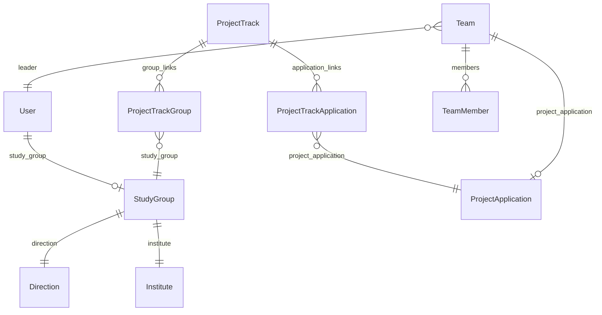
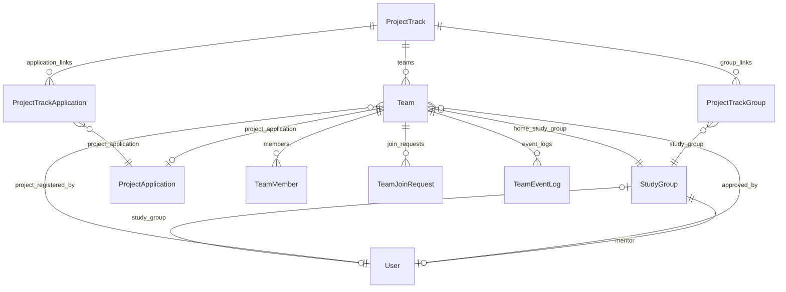
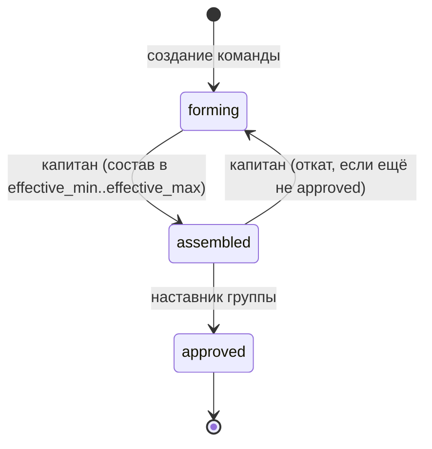

# Схема БД: студенческий портал

Документ описывает **изменения и новые сущности базы данных** для студенческого функционала (5 разделов UI).
API-эндпоинты, сервисы и DTO в этот документ не входят — только данные и бизнес-правила, влияющие на схему.

**Дата:** 2026-08-25
**Статус:** частично реализовано (`User` поля наставника, `StudyGroup.mentor`, `GET /api/teams/study-groups/my/`, лобби/`my-team` workflow `teams.0013`)

---

## 1. Введение и scope

### Разделы UI (взгляд студента)

| # | Раздел | Что нужно от БД |
|---|--------|-----------------|
| 1 | Главная | Группа + наставник (ФИО, должность, степень) |
| 2 | Моя группа | Наставник + список студентов группы с привязкой к команде |
| 3 | Формирование команд | Команды трека, лимит команд, заявки на вступление |
| 4 | Моя команда | Состав, статусы, лог событий, approve/reject/kick/add |
| 5 | Витрина проектов | Проекты трека, таймер регистрации, запись капитана |

### Решения, зафиксированные на этапе проектирования

- **Наставник:** тот же `User` с ролью `mentor`, без отдельной сущности. Привязка к группе — `StudyGroup.mentor` (FK → `User`). Должность / степень / звание — поля на `User`.
- **Лимиты размера команды:** хранятся на `ProjectTrack` и на `ProjectApplication` (`min_team_members` / `max_team_members`); на этапе формирования — также вычисляемые `effective_min` / `effective_max` из проектов трека (см. §5).

### Out of scope (эта итерация)

- Задачи студента, прогресс выполнения проекта, сводка по команде на главной (заглушки UI без новых таблиц).
- Система уведомлений (push/email) — см. открытые вопросы (§9).
- Отдельная модель `Project` — проекты по-прежнему = одобренные `ProjectApplication`.

---

## 2. As-is: текущее состояние

### 2.1. ER-диаграмма (сейчас)



### 2.2. Существующие сущности (релевантные)

| Модель | Файл | Назначение |
|--------|------|------------|
| `User` | `accounts/models.py` | Студент: `study_group`; наставник = тот же `User` с ролью `mentor` |
| `PreRegisteredStudent` | `accounts/models.py` | Контингент, FK `group` → `StudyGroup` |
| `Direction` | `teams/models.py` | Направление подготовки |
| `StudyGroup` | `teams/models.py` | Учебная группа (name, code, direction, institute, mentor, …) |
| `Team` | `teams/models.py` | Команда: name, leader, `project_application` (nullable) |
| `TeamMember` | `teams/models.py` | Участник: role `leader`/`member`, unique `(team, user)` |
| `ProjectTrack` | `showcase/models.py` | Трек: name, department, semester, author, `min_team_members`, `max_team_members` |
| `ProjectTrackGroup` | `showcase/models.py` | Трек ↔ учебная группа |
| `ProjectTrackApplication` | `showcase/models.py` | Трек ↔ заявка/проект |
| `ProjectApplication` | `showcase/models.py` | Заявка/проект; `min_team_members`, `max_team_members`, `recommended_teams_count`, `company_contacts` |
| `Tag` | `showcase/models.py` | Теги проектов |
| `Semester` | `accounts/models.py` | Семестр |

### 2.3. Ключевые пробелы

| Пробел | Влияние на UI |
|--------|---------------|
| ~~Нет `StudyGroup.mentor`~~ **сделано** (`0009_studygroup_mentor`) | Разделы 1–2: наставник группы |
| ~~У `User` нет должности / степени / звания~~ **сделано** (`0020_user_mentor_fields`) | Раздел 1: карточка наставника |
| `Team` не привязана к `ProjectTrack` | ~~Раздел 3~~ **частично:** `TeamSemester.project_track` (0013) |
| Нет `Team.status` | ~~Раздел 4~~ **частично:** `TeamSemester.status` forming/assembled |
| Нет заявок на вступление | ~~Раздел 3–4~~ **сделано:** `TeamJoinRequest` + `TeamInvitation` |
| Нет лога событий команды | ~~Раздел 4~~ **сделано:** `TeamEventLog` |
| `ProjectTrack.max_teams` удалён (миграция `0034`) | Раздел 3: нет максимального числа команд |
| Нет дат регистрации на проекты | Раздел 5: нет таймера |
| Нет периода формирования команд | Раздел 3: нет окон по времени |

---

## 3. To-be: изменения и новые сущности

### 3.1. ER-диаграмма (целевая)



---

### 3.2. Изменения `User` (`accounts`) — данные наставника

**Реализовано:** миграция `accounts/migrations/0020_user_mentor_fields.py`.

Отдельной сущности «наставник» **нет**: наставник — это `User` с `role.code == "mentor"`.
Для карточки наставника на главной / в «Моей группе» добавляются опциональные поля на `User` (используются в основном для роли mentor; у студентов могут оставаться пустыми).

| Поле | Тип | Null | Default | Описание |
|------|-----|------|---------|----------|
| `position` | CharField(255) | нет | `""` | Должность |
| `academic_degree` | CharField(255) | нет | `""` | Учёная степень (к.т.н., д.э.н., …) |
| `academic_title` | CharField(255) | нет | `""` | Учёное звание (доцент, профессор, …) |

ФИО и email уже есть: `last_name`, `first_name`, `middle_name`, `email`.

---

### 3.3. Изменения `StudyGroup` (`teams`)

**Реализовано:** миграция `teams/migrations/0009_studygroup_mentor.py`. Эндпоинт студента: `GET /api/teams/study-groups/my/`.

| Поле | Тип | Null | Описание |
|------|-----|------|----------|
| `mentor` | FK → `User` | да | `on_delete=SET_NULL`, `related_name="mentored_study_groups"`, `verbose_name="Наставник"` |

**Правила:**

- Один наставник на группу (FK, не M2M).
- На уровне сервиса: `mentor.role.code == "mentor"`.
- Наставник может курировать несколько групп (`related_name` — множественное).

Остальные поля группы без изменений: `name`, `code`, `enrollment_year`, `direction`, `institute`, `course_number`, `is_end`, `profile`, `form`.

---

### 3.4. Изменения `ProjectTrack` (`showcase`)

| Поле | Тип | Null | Default | Описание |
|------|-----|------|---------|----------|
| `max_teams` | PositiveIntegerField | нет | `100` | Максимальное число команд в треке (восстановление удалённого поля) |
| `team_formation_start` | DateTimeField | да | `null` | Начало окна формирования команд |
| `team_formation_end` | DateTimeField | да | `null` | Конец окна формирования команд |
| `project_registration_start` | DateTimeField | да | `null` | Начало регистрации команд на проекты (таймер витрины) |
| `project_registration_end` | DateTimeField | да | `null` | Конец регистрации на проекты |
| `min_team_members` | PositiveIntegerField | нет | `1` | Мин. размер команды (миграция `0036`; API: `minTeamMembers`) |
| `max_team_members` | PositiveIntegerField | нет | `10` | Макс. размер команды (миграция `0036`; API: `maxTeamMembers`) |
| `recommended_teams_count` | PositiveIntegerField | нет | `0` | Сумма `recommended_teams_count` заявок трека (миграция `0037`; API: `recommendedTeamsCount`). Пересчёт при add/remove applications и PATCH заявки |

**Validators:** `max_teams >= 1`, `min_team_members >= 1`, `max_team_members >= 1` (`MinValueValidator(1)`).

**Лимиты размера команды:** хранятся на треке и при PATCH трека дублируются на все связанные заявки (`ProjectApplication.min_team_members` / `max_team_members`). В GET list/retrieve отдаются как `minTeamMembers` / `maxTeamMembers`.

**Правила дат (сервисный слой):**

- Если заданы обе даты формирования: `team_formation_start <= team_formation_end`.
- Если заданы обе даты регистрации: `project_registration_start <= project_registration_end`.
- Рекомендуется: `team_formation_end <= project_registration_start` (сначала команды, потом проекты).

---

### 3.5. Изменения `Team` и семестровый контекст (`teams`)

**Реализовано:** миграции `0010_team_semester_models`, `0011_migrate_team_data`, `0012_remove_legacy_team_fields`.

`Team` — постоянная сущность (название, описание, домашняя группа). Семестровые данные вынесены:

#### `Team`

| Поле | Тип | Null | Описание |
|------|-----|------|----------|
| `name`, `description` | — | нет | Без изменений |
| `home_study_group` | FK → `StudyGroup` | да | Группа капитана; `related_name="home_teams"`, `SET_NULL` |
| `created_at`, `updated_at` | DateTime | нет | Без изменений |

Удалены: `leader`, `project_application`. Модель `TeamMember` удалена.

#### `TeamSemester`

| Поле | Тип | Null | Описание |
|------|-----|------|----------|
| `team` | FK → `Team` | нет | `related_name="semester_enrollments"` |
| `semester` | FK → `Semester` | нет | `related_name="team_semesters"` |
| `project_track` | FK → `ProjectTrack` | да | Трек команды в семестре (`PROTECT`, миграция `0013`) |
| `project_application` | FK → `ProjectApplication` | да | Проект в этом семестре |
| `mentor` | FK → `User` | да | Наставник команды в семестре (`role=mentor`) |
| `captain` | FK → `User` | нет | Капитан в этом семестре |
| `status` | `forming` / `assembled` | нет | default `forming` (миграция `0013`) |

Constraint: unique `(team, semester)`.

#### `TeamSemesterMember`

| Поле | Тип | Null | Описание |
|------|-----|------|----------|
| `team_semester` | FK → `TeamSemester` | нет | `related_name="members"` |
| `user` | FK → `User` | нет | `related_name="team_semester_memberships"` |
| `semester` | FK → `Semester` | нет | Денормализация; синхронизируется из `team_semester` |
| `role` | `leader` / `member` | нет | Роль в команде в этом семестре |

Constraints: unique `(team_semester, user)`, unique `(user, semester)` — один студент = одна команда в семестре.

**Слоты команд в треке (лобби):** `SUM(application.recommended_teams_count)` по заявкам трека; `teams_count` — число `TeamSemester` домашней группы студента в треке/семестре.

---

### 3.6. `TeamJoinRequest` (новая, `teams`, миграция `0013`)

Заявка студента на вступление в команду в семестре.

| Поле | Тип | Null | Default | Описание |
|------|-----|------|---------|----------|
| `id` | BigAutoField | PK | — | |
| `team_semester` | FK → `TeamSemester` | нет | — | `related_name="join_requests"`, `on_delete=CASCADE` |
| `user` | FK → `User` | нет | — | Заявитель |
| `status` | CharField(16) | нет | `"pending"` | `pending` / `approved` / `rejected` / `obsolete` |
| `reviewed_by` | FK → `User` | да | `null` | Капитан (approve/reject) |
| `reviewed_at` | DateTimeField | да | `null` | |
| `created_at` | DateTimeField | нет | auto_now_add | |

Partial unique: одна `pending` пара `(team_semester, user)`.

### 3.6a. `TeamInvitation` (новая, `teams`, миграция `0013`)

Приглашение капитана студенту.

| Поле | Тип | Null | Default | Описание |
|------|-----|------|---------|----------|
| `team_semester` | FK → `TeamSemester` | нет | — | |
| `user` | FK → `User` | нет | — | Кого приглашают |
| `invited_by` | FK → `User` | нет | — | Капитан |
| `role` | `member` (обычно) | нет | `member` | Роль при вступлении |
| `status` | CharField | нет | `pending` | `pending` / `accepted` / `rejected` / `obsolete` |
| `reviewed_at` | DateTimeField | да | `null` | |
| `created_at` | DateTimeField | нет | auto_now_add | |

При accept/approve все остальные pending заявки и приглашения студента в семестре → `obsolete`.

---

### 3.7. `TeamEventLog` (новая, `teams`, миграция `0013`)

| Поле | Тип | Null | Описание |
|------|-----|------|----------|
| `user` | FK → `User` | да | db_index; кто совершил действие |
| `team` | FK → `Team` | нет | db_index |
| `team_semester` | FK → `TeamSemester` | да | SET_NULL |
| `text` | TextField | нет | Текст действия |
| `created_at` | DateTimeField | нет | auto_now_add |

**Meta:** `ordering = ["-created_at"]`.

---

### 3.8. Один студент — одна команда в семестре

Обеспечивается constraint `unique_user_semester_team` на `TeamSemesterMember`.

---

### 3.9. Политика полей проекта для студента (не миграция)

Поле `company_contacts` остаётся в `ProjectApplication`.
Студенческий DTO витрины **не отдаёт**:

| Поле | Причина |
|------|---------|
| `company_contacts` | Контакты заказчика — только для сотрудников |
| `author_email`, `author_phone` | Контакты автора заявки (рекомендуется скрыть) |

Whitelist для студенческого detail (ориентир):
`id`, `title`, `company`, `goal`, `barrier`, `problem_holder`, `context`, `stakeholders`, `experts`, `recommended_tools`, `existing_solutions`, `additional_materials`, `project_level`, `tags`, `min_team_members`, `max_team_members`, `recommended_teams_count`, `is_continuing`, `img`, `print_number`.

---

## 4. State machine статусов команды и блокировки

### 4.1. Диаграмма переходов



Обратный переход `approved → *` **запрещён** (кроме admin / ручной правки в Django Admin с явным аудитом).

### 4.2. Кто что может

| Действие | forming | assembled | approved |
|----------|---------|-----------|----------|
| Вступить / подать заявку | да | да\* | нет |
| Approve/reject заявки (капитан) | да | да\* | нет |
| Добавить участника (капитан) | да | да\* | нет |
| Kick участника (капитан) | да | да\* | нет |
| Выйти из команды (участник) | да | да\* | нет |
| Капитан: `forming → assembled` | да | — | — |
| Капитан: `assembled → forming` | — | да | — |
| Наставник: `assembled → approved` | — | да | — |
| Запись на проект (капитан) | нет | нет | да + окно регистрации |

\* Пока статус не `approved`, состав можно менять. После `approved` — состав заморожен.

### 4.3. Условия переходов

**`forming → assembled` (капитан):**

1. Текущий пользователь = `team.leader`.
2. `effective_min <= members_count <= effective_max` (см. §5).
3. Команда в окне формирования (если даты на треке заданы) — опциональная проверка.

**`assembled → forming` (капитан):**

1. Текущий пользователь = `team.leader`.
2. `team.status == assembled` (ещё не утверждён наставником).

**`assembled → approved` (наставник):**

1. Текущий пользователь = `team.home_study_group.mentor` (или admin).
2. Повторная проверка размера: `effective_min <= members_count <= effective_max`.
3. Запись: `approved_by`, `approved_at`; лог `composition_approved` + `status_changed`.

### 4.4. Регистрация на проект

1. `team.status == approved`.
2. `team.project_application is null` (смена проекта запрещена).
3. `now` в `[project_registration_start, project_registration_end]` (если даты заданы).
4. Проект входит в трек: существует `ProjectTrackApplication(track, application)`.
5. `application.min_team_members <= members_count <= application.max_team_members`.
6. Число команд на проекте не превышает `application.recommended_teams_count` (бизнес-правило квоты; уточняется при реализации API).
7. Актор = капитан; пишутся `project_application`, `project_registered_at`, `project_registered_by`; лог `project_registered`.

---

## 5. Вычисляемые лимиты размера команды (effective_min / effective_max)

На этапе формирования проект ещё не выбран. Лимиты размера команды для проверки «команда подходит любому проекту» вычисляются из проектов трека. На самом `ProjectTrack` также хранятся `min_team_members` / `max_team_members` (дефолт трека; синхронизируются на заявки при PATCH).

### 5.1. Формулы

Пусть `A` — множество `ProjectApplication`, связанных с треком через `ProjectTrackApplication`.

```
effective_min = MAX(a.min_team_members for a in A)
effective_max = MIN(a.max_team_members for a in A)
```

Интерпретация:

- Команда должна быть **не меньше** самого строгого минимума среди проектов трека.
- Команда должна быть **не больше** самого строгого максимума среди проектов трека.
- Так команда теоретически подходит под любой проект трека (при непустом пересечении диапазонов).

### 5.2. Краевые случаи

| Ситуация | Поведение |
|----------|-----------|
| В треке нет проектов (`A` пусто) | Нельзя перевести в `assembled`; `effective_min`/`effective_max` = `null`; UI показывает предупреждение |
| `effective_min > effective_max` | Диапазоны проектов не пересекаются; перевод в `assembled` запрещён до исправления лимитов на заявках |
| Регистрация на конкретный проект | Проверка уже по `application.min_team_members` / `max_team_members`, а не по effective_* |

### 5.3. Где считаются

- **Не колонки БД** — вычисление в repository/service при чтении трека / команды.
- Для UI раздела 3–4 отдавать в DTO: `effective_min`, `effective_max`, `members_count`, `can_mark_assembled`.

### 5.4. Связь с существующими полями

Поля есть на `ProjectApplication` (миграция `showcase.0035`) и на `ProjectTrack` (миграция `showcase.0036`):

- `min_team_members` (default 1)
- `max_team_members` (default 10)
- `recommended_teams_count` (default 3, только на заявке) — квота команд на проект, не размер команды

При PATCH `/api/showcase/project-tracks/{id}/` с `minTeamMembers` / `maxTeamMembers` значения пишутся на трек и на все связанные заявки.

---

## 6. Маппинг разделов UI → сущности БД

| Раздел UI | Читаемые сущности | Пишущие операции | Вычисляемые поля (не в БД) |
|-----------|-------------------|------------------|----------------------------|
| **1. Главная** | `User`, `StudyGroup` (+ direction, institute), `StudyGroup.mentor` (`User`) | — | Заглушки: команда / задачи / прогресс — later |
| **2. Моя группа** | `StudyGroup`, mentor, `PreRegisteredStudent`, при `semester_id` — `TeamSemesterMember` | — | `team` в members: `Team.name` + `role` через `TeamSemesterMember` |
| **3. Формирование команд** | `ProjectTrack` (`max_teams`, даты), `Team` (фильтр по треку группы), `TeamMember` (count, captain), `TeamJoinRequest` | create `Team`, create `TeamJoinRequest` | `teams_count`, `can_create_team` (`teams_count < max_teams`), `effective_min`/`effective_max` |
| **4. Моя команда** | `Team`, `TeamMember`, `TeamJoinRequest` (pending для капитана), `TeamEventLog` | approve/reject join, add/kick/leave, смена `status`, утверждение наставником | `is_leader`, `can_leave`, список кандидатов поиска по ФИО в группах трека |
| **5. Витрина проектов** | `ProjectTrack` (даты регистрации), `ProjectTrackApplication` → `ProjectApplication`, `Tag` | капитан: set `Team.project_application` (+ registered_*) | `registration_opens_in`, `can_register` (approved + окно + нет проекта), фильтры по тегам |

### 6.1. Раздел 1 — детализация данных

**Группа (уже есть):**
`name`, `code`, `enrollment_year`, `course_number`, `is_end`, `profile`, `form`, `direction` (code, name, level), `institute` (code, name).

**Наставник (тот же `User`, без отдельной модели):**
`last_name`, `first_name`, `middle_name`, `email`, `position`, `academic_degree`, `academic_title`.
Роль: `role.code == "mentor"`. Привязка: `StudyGroup.mentor`.

### 6.2. Раздел 2 — строка таблицы группы

| Колонка UI | Источник |
|------------|----------|
| ФИО | `User.last_name`, `first_name`, `middle_name` |
| Почта | `User.email` |
| Команда | `Team.name` через `TeamSemesterMember` в запрошенном семестре, иначе `null` |

### 6.3. Раздел 3 — карточка команды в списке

| Колонка UI | Источник |
|------------|----------|
| Название | `Team.name` |
| Число участников | `COUNT(TeamMember)` |
| Капитан | `Team.leader` (ФИО) |
| Кол-во команд в треке | `COUNT(Team WHERE project_track=…)` |
| Макс. команд | `ProjectTrack.max_teams` |
| Кнопка «Создать» | `teams_count < max_teams` и студент без команды в треке |

### 6.4. Раздел 4 — роли

| Роль | Возможности (данные) |
|------|----------------------|
| Участник | Состав, `TeamEventLog`, выход (`member_left`) |
| Капитан | + pending `TeamJoinRequest`, kick, add (поиск User по ФИО в группах того же `ProjectTrack`), смена статуса forming↔assembled |
| Наставник | Утверждение `assembled → approved` для команд своей группы |

Поиск «из другой группы того же трека» — без новых таблиц:

```
User.study_group_id IN (
  SELECT study_group_id FROM ProjectTrackGroup WHERE project_track_id = :track
)
AND full_name ILIKE :query
AND role = student
AND not already in a team of this track
```

### 6.5. Раздел 5 — витрина

| Элемент UI | Источник |
|------------|----------|
| Список проектов | `ProjectTrackApplication` → `ProjectApplication` (status approved) для трека группы студента |
| Таймер | `ProjectTrack.project_registration_start` − now |
| Предупреждение «нельзя выбирать» | `team is null OR team.status != approved OR team.project_application_id IS NOT NULL` |
| Теги / поиск / сортировка | `Tag` M2M + поля заявки (repository filters) |
| Детали без контактов | whitelist DTO (§3.9) |

---

## 7. Порядок миграций

| # | App | Предлагаемое имя | Содержание | Зависимости |
|---|-----|------------------|------------|-------------|
| 1 | `accounts` | `0020_user_mentor_fields` (сделано) | Поля `User`: `position`, `academic_degree`, `academic_title` | `0019` |
| 2 | `teams` | `0009_studygroup_mentor` (сделано) | `StudyGroup.mentor` FK | accounts `0020`, teams `0008` |
| 2a | `teams` | `0010`–`0012` (сделано) | `TeamSemester`, `TeamSemesterMember`, `home_study_group`; удалены `TeamMember`, `Team.leader` | `0009` |
| 3 | `showcase` | `0036_projecttrack_team_settings` | `max_teams`, `team_formation_*`, `project_registration_*` | showcase `0035` |
| 4 | `teams` | `0013_team_workflow` | Поля `TeamSemester`: status, approved_*, project_registered_* | `0012` |
| 5 | `teams` | `0011_team_join_request` | `TeamJoinRequest` + partial unique | `0010` |
| 6 | `teams` | `0012_team_event_log` | `TeamEventLog` | `0011` |

Нумерация `accounts` / `teams` уточняется по фактическим последним миграциям на момент реализации.

### 7.1. Data migration для существующих `Team` (шаг 4)

Сейчас `Team` может не иметь `project_track`. Стратегия:

1. Добавить `project_track` и `home_study_group` как **nullable**.
2. Data migration:
   - Если есть `project_application` и ровно один трек через `ProjectTrackApplication` — проставить `project_track`.
   - Если несколько треков — взять трек семестра заявки / первый по id; записать warning в лог миграции.
   - Если трек не найден — оставить `null` и пометить в admin / удалить тестовые записи.
   - `home_study_group` ← `leader.study_group_id` (если есть).
   - `status` ← `'forming'` для всех существующих.
3. Для продакшена: после ручной проверки — `AlterField` на NOT NULL **или** оставить nullable с запретом создания без трека на уровне сервиса.

**Рекомендация MVP:** после data migration сделать `project_track` обязательным; «осиротевшие» команды без трека — удалить или привязать вручную до выкладки.

### 7.2. Индексы (рекомендуемые)

| Модель | Индекс | Зачем |
|--------|--------|-------|
| `Team` | `(project_track, status)` | Список команд трека, фильтр по статусу |
| `TeamMember` | `(user,)` уже через FK | «Моя команда», проверка членства |
| `TeamJoinRequest` | `(team, status)` | Pending для капитана |
| `TeamEventLog` | `(team, -created_at)` | Лента истории |
| `StudyGroup` | `(mentor,)` | Группы наставника |

---

## 8. Сводка: новые vs изменённые сущности

### Новые модели

| Модель | App |
|--------|-----|
| `TeamSemester` | teams |
| `TeamSemesterMember` | teams |
| `TeamJoinRequest` | teams |
| `TeamEventLog` | teams |

### Изменённые модели

| Модель | App | Что добавлено |
|--------|-----|---------------|
| `User` | accounts | `position`, `academic_degree`, `academic_title` (для наставника; отдельной модели нет) |
| `StudyGroup` | teams | `mentor` → `User` |
| `Team` | teams | `home_study_group`; без `leader` / `project_application` |
| `TeamSemester` | teams | семестр, капитан, наставник, проект |
| `TeamSemesterMember` | teams | роль студента в команде в семестре |
| `ProjectTrack` | showcase | `max_teams`, `team_formation_start/end`, `project_registration_start/end` (ещё не сделано) |

### Без изменений схемы (используются as-is)

- `Direction`, `Institute`, `User.study_group`, `PreRegisteredStudent`
- `TeamMember` (логика расширяется, схема полей та же)
- `ProjectApplication` / `Tag` / `ProjectTrackGroup` / `ProjectTrackApplication`
- `Semester`

---

## 9. Открытые вопросы (вне схемы или follow-up)

1. **Уведомления капитану** о новой заявке на вступление — отдельный канал (email / in-app). Для in-app может понадобиться модель `Notification` (не в этой итерации).
2. **Квота команд на проект** (`recommended_teams_count`): жёсткий лимит или мягкая рекомендация при записи?
3. **Несколько треков** у одной учебной группы в одном семестре — как выбирать «активный» трек для студента?
4. **Строгий unique** «один студент — одна команда в треке» на уровне БД vs только сервис.
5. **Откат `approved`** наставником / admin — нужен ли сценарий «вернуть на доработку»?
6. **Поля наставника на `User`:** заполняются вручную в admin / self-service наставника?

---

## 10. Файлы для будущей реализации (не сейчас)

| Файл | Изменения |
|------|-----------|
| `accounts/models.py` | поля `User`: `position`, `academic_degree`, `academic_title` |
| `teams/models.py` | `StudyGroup.mentor`, расширение `Team`, `TeamJoinRequest`, `TeamEventLog` |
| `showcase/models.py` | поля `ProjectTrack` |
| `accounts/migrations/` | поля наставника на `User` |
| `teams/migrations/` | mentor, team workflow, join request, event log |
| `showcase/migrations/` | project track settings |
| `teams/admin.py`, `accounts/admin.py`, `showcase/admin.py` | регистрация новых полей/моделей |

---

## Приложение A. Черновик TextChoices (для реализации)

```python
# Team
class Status(models.TextChoices):
    FORMING = "forming", "В стадии формирования"
    ASSEMBLED = "assembled", "Состав собран"
    APPROVED = "approved", "Состав утверждён"

# TeamJoinRequest
class Status(models.TextChoices):
    PENDING = "pending", "Ожидает"
    APPROVED = "approved", "Одобрена"
    REJECTED = "rejected", "Отклонена"
    CANCELLED = "cancelled", "Отменена"

# TeamEventLog.action_type — см. таблицу в §3.7
```

## Приложение B. Связь с разделами backlog

| Итерация | Содержание |
|----------|------------|
| **Текущая (этот документ)** | Проектирование БД |
| Следующая | Миграции + модели + admin |
| Далее | Domain / services / API для разделов 1–5 |
| Later | Задачи, прогресс, уведомления |
